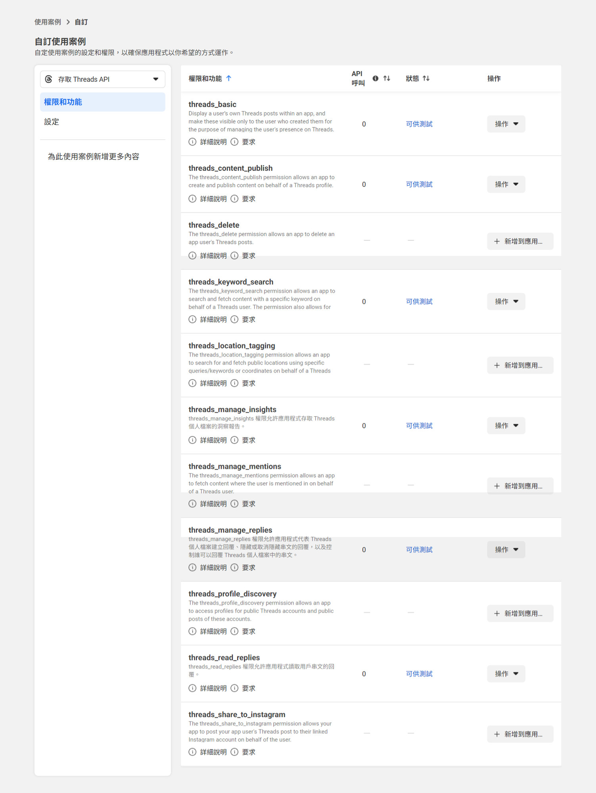
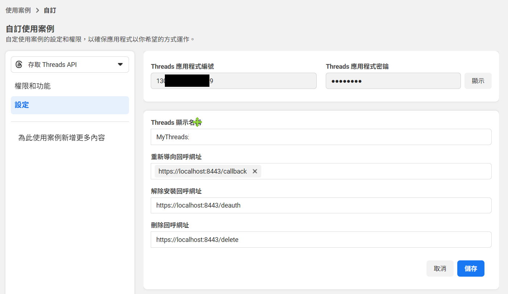
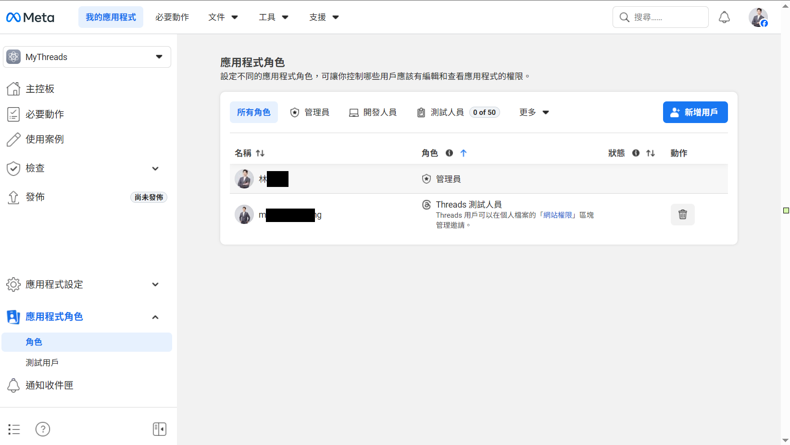
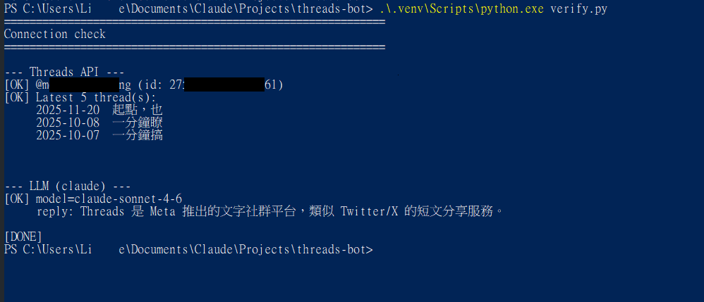
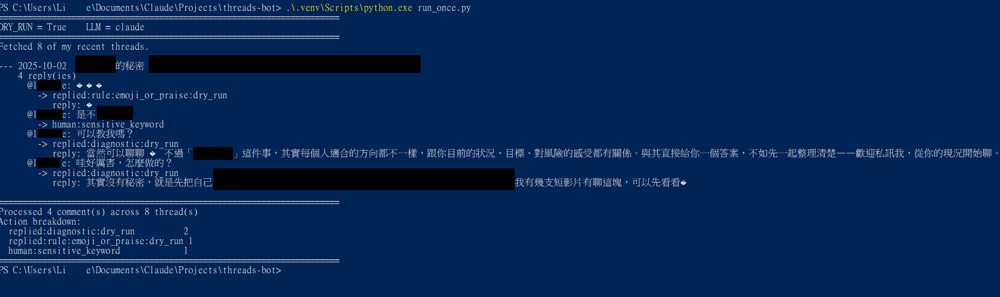

# Threads 自動回覆 Bot 完整建置指南

> 從 0 開始建立一個會自動回覆留言、AI 草擬陌生人留言的 Threads bot。
>
> **目標讀者**：國中生跟著做也能完成
> **預計時間**：分階段做，總共 3-5 小時
> **預計花費**：USD $5（Anthropic API credit，可用 1-2 個月）
> **作業系統**：Windows 為主（Mac 也可，部分指令略有差異）

---

<a id="toc"></a>
## 📚 目錄

1. [你會做出什麼](#features)
2. [開始前的準備](#prereq)
3. [Phase 1：Meta App + Token](#phase1)
4. [Phase 2：Python 專案 + 程式碼](#phase2)
5. [Phase 3：填設定 + 驗證連線](#phase3)
6. [Phase 4：每天怎麼用](#phase4)
7. [客製化：改成你自己的品牌](#customize)
8. [常見問題排除](#faq)
9. [進階：未來想升級的話](#advanced)

---

<a id="features"></a>
## 🎯 0.1 你會做出什麼

兩個核心功能：

### 功能 ① 自家貼文留言 → 自動回覆

Bot 每 5 分鐘檢查你 Threads 自己的最新 8 則貼文，**有新留言進來自動分類處理**：

| 留言類型 | 怎麼處理 |
|---|---|
| 「請問可以諮詢嗎？」（商業關鍵字） | 用固定模板回覆，引導私訊 |
| 「🔥🔥🔥」「推」「+1」 | 回一個對應 emoji（🔥 / 🙏） |
| 「深蹲跟硬舉先練哪個？」（一般提問） | Claude AI 根據你的品牌語氣寫回覆 |
| 「是不是詐騙？」（敏感字） | 不自動回，標記給你親自處理 |
| 「你寫的根本沒用」（負評） | Claude 判斷後標記給你親自處理 |

### 功能 ② 陌生人貼文 → AI 草擬回覆

你滑 Threads 看到別人有趣的貼文 → **複製文字貼進 bot** → Claude 用你的品牌語氣寫一段回覆草稿 → 你決定要不要送出。

> ⚠️ **不會自動發送陌生人留言**——這是設計上的決定，避免被當 spam 封號 + 保護品牌信任。

---

<a id="prereq"></a>
## 📋 0.2 開始前的準備

### 必備帳號（事先去申請好）

- [ ] **Threads 帳號**（你日常使用的那個）
- [ ] **Facebook 帳號**（跟 Threads 同一個 Meta 帳號體系）
- [ ] **Email**（驗證用）
- [ ] **信用卡**（要儲值 USD $5 給 Anthropic API）

### 必備軟體

#### Python 3.11 或更新版本

→ 下載：[python.org/downloads](https://www.python.org/downloads/)

點大大的「Download Python 3.x.x」→ 下載 → 安裝。

> ⚠️ **安裝時務必勾選「Add Python to PATH」**（畫面下方的選項），否則之後指令打不開。

驗證裝好：按 Win 鍵搜尋「PowerShell」打開，輸入：
```powershell
python --version
```
看到 `Python 3.11.x` 或更新版本就 OK。

#### 文字編輯器

→ [VS Code 免費下載](https://code.visualstudio.com/Download)（推薦）

或者用 Windows 內建的「記事本」也可以，只是體驗較陽春。

[⬆️ 回到目錄](#toc)

---

<a id="phase1"></a>
# Phase 1：Meta App + Token

## Step 1：申請 Meta Developer + 建立 App

### 1-A. 註冊 Meta Developer（已註冊跳到 1-B）

1. 開 [developers.facebook.com](https://developers.facebook.com/)
2. 右上角點「**開始使用**」
3. 用你日常的 Facebook 帳號登入
4. 同意條款，可能需要驗證手機簡訊

> 💡 **強烈建議：開啟兩階段驗證 (2FA)**。Meta 對開發者帳號要求嚴。

### 1-B. 建立新 App

1. 開 [developers.facebook.com/apps/creation](https://developers.facebook.com/apps/creation/)
2. 第 1 頁「使用案例」：勾選「**存取 Threads API**」→ 下一步
3. 第 2 頁「應用程式詳細資料」：
   - **應用程式的名稱**：填 `[你的名字]Bot`（不要含 Meta / Facebook / Instagram / Threads 字樣）
   - **聯絡電子郵件**：填你的 email
   - 下一步
4. 第 3 頁「商家資產管理組合」：選「**我還不想連結商家資產管理組合**」→ 下一步
5. 第 4 頁：點「**前往主控板**」（Go to Dashboard）

進到主控板後應該長這樣：


[⬆️ 回到目錄](#toc)

---

## Step 2：設定 Threads 使用案例

### 2-A. 加入 6 個權限

1. 主控板點「**自訂存取 Threads API 的使用案例**」
2. 進入「權限和功能」分頁
3. 找到下面 6 個權限，每個都點「**新增**」按鈕：

| 權限 | 用途 |
|---|---|
| `threads_basic` | 讀取你自己的資料、貼文 |
| `threads_content_publish` | 發貼文、發回覆 |
| `threads_manage_replies` | 管理留言 |
| `threads_read_replies` | 讀取貼文留言 |
| `threads_keyword_search` | 搜尋關鍵字（功能 #2 用） |
| `threads_manage_insights` | 看貼文成效 |

加完後狀態都會變成「**可供測試**」：



### 2-B. 設定 Redirect URL

1. 切到「**設定**」分頁
2. 三個欄位填：

| 欄位 | 填入 |
|---|---|
| 重新導向 Callback 網址 | `https://localhost:8443/callback` |
| 解除安裝 Callback 網址 | `https://localhost:8443/deauth` |
| 資料刪除 Callback 網址 | `https://localhost:8443/delete` |

3. 點「**儲存變更**」。



### 2-C. 紀錄 App ID 和 App Secret

在同一頁最上方有：
- **Threads 應用程式編號**（App ID）：一串 16 位數字 → 複製到記事本
- **Threads 應用程式密鑰**（App Secret）：點「**顯示**」看到一串文字 → 複製到記事本

> ⚠️ **App Secret 是密碼等級！** 千萬不要：截圖、貼到聊天、傳給別人、上傳 GitHub。等等只會在你本機 .env 檔使用。

[⬆️ 回到目錄](#toc)

---

## Step 3：把自己加為 Threads Tester

> **為什麼要這步？** App 在開發模式下，OAuth 授權需要把你的 Threads 帳號加到「測試人員」清單。

1. 主控板左側找「**應用程式角色**」→「**角色**」
2. 找到「**Threads 測試人員**」區塊 → 點「**新增 Threads 測試人員**」
3. 輸入你 Threads 的 username（不含 @）→ 送出
4. 開手機 **Threads App** → 個人檔案 → 設定 → **「Apps and Websites」** → 切到 **「Invites」** 分頁 → 看到你的 App 名稱 +「**接受 / 拒絕**」按鈕 → 點 **接受** → 跳出確認框再按 **接受**

手機 App 上的邀請畫面長這樣：


5. 回 Meta dashboard 重新整理，看到狀態「已接受」 / 沒有「待處理」標記就好

成功的角色頁長這樣（你會看到自己列在 Threads 測試人員）：



> 找不到 App 邀請通知的話：直接開 [threads.net/manage/invites](https://www.threads.net/manage/invites)（網頁版）接受。

[⬆️ 回到目錄](#toc)

---

## Step 4：取得 60 天 Access Token

### 4-A. 開啟授權頁面

複製這串網址，**把 `__YOUR_APP_ID__` 換成你 Step 2-C 紀錄的 App ID**，然後貼到瀏覽器：

```
https://threads.net/oauth/authorize?client_id=__YOUR_APP_ID__&redirect_uri=https%3A%2F%2Flocalhost%3A8443%2Fcallback&scope=threads_basic%2Cthreads_content_publish%2Cthreads_manage_replies%2Cthreads_read_replies%2Cthreads_keyword_search%2Cthreads_manage_insights&response_type=code
```

→ 應該看到 Threads 授權頁，點「**允許**」。

### 4-B. 複製 code

授權後瀏覽器會跳到 `https://localhost:8443/callback?code=AQDxxx...`，**頁面會顯示「無法連線」這是正常的**。

但**網址列**有完整 URL，找到 `code=` 後面那串長字（**不含結尾的 `#_`**），複製到記事本。

> ⚠️ code 只有 10 分鐘有效，下面動作要快。

### 4-C. 用 PowerShell 換 Token

開 PowerShell（Win 鍵搜尋「PowerShell」），複製貼上以下指令，**3 個 `__FILL_IN__` 換成你的值**：

```powershell
$appId = "__FILL_IN_YOUR_APP_ID__"
$appSecret = "__FILL_IN_YOUR_APP_SECRET__"
$code = "__FILL_IN_THE_CODE__"
$redirectUri = "https://localhost:8443/callback"

$body = @{
  client_id     = $appId
  client_secret = $appSecret
  grant_type    = "authorization_code"
  redirect_uri  = $redirectUri
  code          = $code
}
$shortResp = Invoke-RestMethod -Uri "https://graph.threads.net/oauth/access_token" -Method Post -Body $body
$shortResp
```

預期看到：
```
access_token       user_id
------------       -------
THAA...xxxx        12345678901234567
```

接著（**同一個 PowerShell 視窗**）跑：

```powershell
$shortToken = $shortResp.access_token
$longResp = Invoke-RestMethod -Uri "https://graph.threads.net/access_token?grant_type=th_exchange_token&client_secret=$appSecret&access_token=$shortToken"
$longResp | Format-List *
```

預期看到：
```
access_token : THAA...yyyy（一長串）
token_type   : bearer
expires_in   : 5183xxx（≈60天 = 5184000 秒）
```

**把這 4 個值記下來**（複製到記事本）：
- App ID（你已經有）
- App Secret（你已經有）
- **長期 Token**（`access_token` 那串）
- **User ID**（`$shortResp.user_id` 那串 17 位數字）

[⬆️ 回到目錄](#toc)

---

<a id="phase2"></a>
# Phase 2：Python 專案 + 程式碼

## Step 5：建立專案資料夾 + 虛擬環境

### 5-A. 決定放哪

建議放：`C:\Users\[你的使用者名]\Documents\threads-bot\`

或自己選一個容易找的位置。

### 5-B. 在 PowerShell 建環境

把下面整段**一次貼進 PowerShell**（**注意改路徑**）：

```powershell
$proj = "C:\Users\[你的使用者名]\Documents\threads-bot"
New-Item -ItemType Directory -Path $proj -Force | Out-Null
New-Item -ItemType Directory -Path "$proj\src" -Force | Out-Null
New-Item -ItemType Directory -Path "$proj\data" -Force | Out-Null
python -m venv "$proj\.venv"

$py = "$proj\.venv\Scripts\python.exe"
& $py -m pip install --upgrade pip --quiet
& $py -m pip install requests anthropic python-dotenv schedule pyperclip --quiet
Write-Host "OK, 環境建好了"
```

看到「OK, 環境建好了」就成功了。

> 💡 套件說明：
> - `requests`：呼叫 Threads API
> - `anthropic`：呼叫 Claude AI
> - `python-dotenv`：讀 .env 設定檔
> - `schedule`：定時任務
> - `pyperclip`：複製到剪貼簿

[⬆️ 回到目錄](#toc)

---

## Step 6：建立程式檔案

需要建立 12 個檔案。**用 [VS Code](https://code.visualstudio.com/Download) 或記事本**逐一新增、複製貼上下面的內容、存檔。

> 💡 用 VS Code：「File → Open Folder」打開你的專案資料夾。然後右鍵新增檔案。

### 檔案 1：`.gitignore`（放在專案根目錄）

```
.venv/
.env
__pycache__/
*.pyc
data/
.DS_Store
*.log
```

### 檔案 2：`requirements.txt`

```
requests
anthropic
python-dotenv
schedule
pyperclip
```

### 檔案 3：`.env`（注意：**不要分享這個檔給任何人，也不要 commit 到 GitHub**）

下面是「樣板」，等到 Step 7 再填值：

```
THREADS_APP_ID=
THREADS_APP_SECRET=
THREADS_USER_ID=
THREADS_USERNAME=
THREADS_LONG_LIVED_TOKEN=

LLM_PROVIDER=claude

ANTHROPIC_API_KEY=
CLAUDE_MODEL=claude-sonnet-4-6

MAX_REPLIES_PER_DAY=80
MAX_REPLIES_PER_HOUR=15
QUIET_HOURS_START=3
QUIET_HOURS_END=7
DRY_RUN=true
```

### 檔案 4：`src/__init__.py`（空檔案，內容什麼都不放）

### 檔案 5：`src/config.py`

```python
from pathlib import Path
from dotenv import load_dotenv
import os

ROOT = Path(__file__).resolve().parent.parent
load_dotenv(ROOT / ".env")

THREADS_APP_ID = os.environ["THREADS_APP_ID"]
THREADS_APP_SECRET = os.environ["THREADS_APP_SECRET"]
THREADS_USER_ID = os.environ["THREADS_USER_ID"]
THREADS_USERNAME = os.environ.get("THREADS_USERNAME", "")
THREADS_LONG_LIVED_TOKEN = os.environ["THREADS_LONG_LIVED_TOKEN"]

LLM_PROVIDER = os.environ.get("LLM_PROVIDER", "claude").lower()
ANTHROPIC_API_KEY = os.environ.get("ANTHROPIC_API_KEY", "")
CLAUDE_MODEL = os.environ.get("CLAUDE_MODEL", "claude-sonnet-4-6")

MAX_REPLIES_PER_DAY = int(os.environ.get("MAX_REPLIES_PER_DAY", 80))
MAX_REPLIES_PER_HOUR = int(os.environ.get("MAX_REPLIES_PER_HOUR", 15))
QUIET_HOURS_START = int(os.environ.get("QUIET_HOURS_START", 3))
QUIET_HOURS_END = int(os.environ.get("QUIET_HOURS_END", 7))
DRY_RUN = os.environ.get("DRY_RUN", "true").lower() == "true"

THREADS_API_BASE = "https://graph.threads.net/v1.0"
```

### 檔案 6：`src/llm.py`

```python
from . import config


def draft(system: str, user: str, max_tokens: int = 500) -> str:
    from anthropic import Anthropic
    client = Anthropic(api_key=config.ANTHROPIC_API_KEY)
    resp = client.messages.create(
        model=config.CLAUDE_MODEL,
        max_tokens=max_tokens,
        system=system,
        messages=[{"role": "user", "content": user}],
    )
    return resp.content[0].text.strip()
```

### 檔案 7：`src/threads_client.py`

```python
import requests
from . import config


def _get(path: str, **params):
    params["access_token"] = config.THREADS_LONG_LIVED_TOKEN
    r = requests.get(f"{config.THREADS_API_BASE}/{path}", params=params, timeout=15)
    r.raise_for_status()
    return r.json()


def _post(path: str, **data):
    data["access_token"] = config.THREADS_LONG_LIVED_TOKEN
    r = requests.post(f"{config.THREADS_API_BASE}/{path}", data=data, timeout=15)
    r.raise_for_status()
    return r.json()


def list_my_recent_threads(limit: int = 10) -> list[dict]:
    resp = _get("me/threads", fields="id,text,timestamp,permalink", limit=limit)
    return resp.get("data", [])


def list_replies(thread_id: str, limit: int = 100) -> list[dict]:
    resp = _get(
        f"{thread_id}/replies",
        fields="id,text,username,timestamp,replied_to",
        limit=limit,
    )
    return resp.get("data", [])


def post_reply(reply_to_id: str, text: str) -> dict:
    container = _post(
        f"{config.THREADS_USER_ID}/threads",
        media_type="TEXT", text=text, reply_to_id=reply_to_id,
    )
    creation_id = container["id"]
    published = _post(f"{config.THREADS_USER_ID}/threads_publish", creation_id=creation_id)
    return {"creation_id": creation_id, "published_id": published.get("id")}
```

### 檔案 8：`src/state.py`

```python
import json
from datetime import datetime, timezone
from pathlib import Path

ROOT = Path(__file__).resolve().parent.parent
DATA = ROOT / "data"
DATA.mkdir(exist_ok=True)

REPLIED_FILE = DATA / "replied_ids.json"
HUMAN_QUEUE = DATA / "human_queue.jsonl"
ACTION_LOG = DATA / "actions.jsonl"


def _load_replied() -> set[str]:
    if not REPLIED_FILE.exists():
        return set()
    return set(json.loads(REPLIED_FILE.read_text(encoding="utf-8")).get("ids", []))


def is_replied(comment_id: str) -> bool:
    return comment_id in _load_replied()


def mark_replied(comment_id: str) -> None:
    ids = _load_replied()
    ids.add(comment_id)
    REPLIED_FILE.write_text(
        json.dumps({"ids": sorted(ids)}, ensure_ascii=False, indent=2),
        encoding="utf-8",
    )


def add_to_human_queue(comment: dict, parent_post: dict, reason: str) -> None:
    entry = {
        "queued_at": datetime.now(timezone.utc).isoformat(),
        "reason": reason,
        "comment": comment,
        "parent_post": {"id": parent_post.get("id"), "text": parent_post.get("text")},
    }
    with HUMAN_QUEUE.open("a", encoding="utf-8") as f:
        f.write(json.dumps(entry, ensure_ascii=False) + "\n")


def log_action(comment_id: str, action: str, detail: dict | None = None) -> None:
    entry = {
        "ts": datetime.now(timezone.utc).isoformat(),
        "comment_id": comment_id,
        "action": action,
        "detail": detail or {},
    }
    with ACTION_LOG.open("a", encoding="utf-8") as f:
        f.write(json.dumps(entry, ensure_ascii=False) + "\n")
```

### 檔案 9：`src/safety.py`

```python
from . import llm

SENSITIVE_KEYWORDS = [
    "告你", "提告", "法律", "詐欺", "詐騙", "騙人", "騙錢", "退費", "求償", "賠償",
    "去死", "幹你", "操你", "白癡", "智障", "廢物", "垃圾",
    "我帳戶", "盜刷", "被駭", "被盜",
    "想自殺", "不想活", "想不開",
]


def keyword_flagged(text: str) -> str | None:
    if not text:
        return None
    for kw in SENSITIVE_KEYWORDS:
        if kw in text:
            return kw
    return None


CLASSIFIER_SYSTEM = """你是社群留言安全分類器。判斷下面這則留言是否屬於以下任一類：
- 負評/批評/嘲諷
- 客訴/抱怨
- 引戰/挑釁
- 涉及法律、金錢糾紛、隱私
- 嚴重情緒（自殘、輕生、人身攻擊）

只回單字 yes 或 no，不要解釋。"""


def claude_says_negative(text: str) -> bool:
    if not text or not text.strip():
        return False
    out = llm.draft(
        system=CLASSIFIER_SYSTEM,
        user=f"留言：「{text}」",
        max_tokens=10,
    )
    return out.strip().lower().startswith("yes")
```

### 檔案 10：`src/rules.py`

> ⚠️ **這個檔案的內容你之後要客製化成你自己品牌**。先複製預設版，後面再改。

```python
import re

EMOJI_MAP = {
    "🔥": "🔥", "❤️": "❤️", "❤": "❤️", "🩷": "❤️", "💗": "❤️",
    "💕": "❤️", "💖": "❤️", "😂": "😂", "🤣": "😂",
    "👍": "🙏", "🙌": "🙏", "💯": "🙏", "🤩": "🙏", "🥹": "🙏",
}

SHORT_PRAISE = {"推", "讚", "好", "棒", "帥", "酷", "+1", "收藏", "強", "厲害"}


def _is_pure_emoji(text: str) -> bool:
    return not re.search(r"\w", text, flags=re.UNICODE)


def _is_short_praise(text: str) -> bool:
    return text in SHORT_PRAISE


def _emoji_response(text: str) -> str:
    for emoji, reply in EMOJI_MAP.items():
        if emoji in text:
            return reply
    return "🙏"


def _has_any(patterns):
    return lambda t: any(p in t for p in patterns)


RULES = [
    {
        "name": "consultation",
        "match": _has_any(["諮詢", "想諮詢", "可以諮詢", "預約諮詢"]),
        "render": lambda t: "謝謝你的詢問！諮詢可以直接私訊我聊聊，我會儘快回你 🙏",
    },
    {
        "name": "collab_or_sponsor",
        "match": _has_any(["合作", "業配", "業務合作", "業務洽詢", "想合作"]),
        "render": lambda t: "謝謝邀請！合作相關可以直接私訊我，我們聊聊細節 🙌",
    },
    {
        "name": "pricing",
        "match": _has_any(["報價", "收費多少", "費用多少", "怎麼收費", "多少錢"]),
        "render": lambda t: "費用因方案不同，方便的話請私訊我，我提供詳細報價 🙏",
    },
    {
        "name": "emoji_or_praise",
        "match": lambda t: _is_pure_emoji(t) or _is_short_praise(t),
        "render": _emoji_response,
    },
]


def match(text: str) -> dict | None:
    if not text:
        return None
    text = text.strip()
    for rule in RULES:
        if rule["match"](text):
            return {"name": rule["name"], "template": rule["render"](text)}
    return None
```

### 檔案 11：`src/drafter.py`

> ⚠️ **這個檔案的 SYSTEM 內容你也要客製化成你自己品牌**。先複製預設版，後面再改。

```python
import json
import re
from . import llm


SYSTEM = """你是一個 Threads 創作者的留言助理。

【關於這個身份】
- 主題：[請填入你的內容主題，例如：理財、健身、料理、旅遊、心理...]
- 風格：[請填入你的個性，例如：專業但親切、幽默、溫暖...]
- 受眾：[請填入你的目標族群]

【絕對禁止】
- [視你的領域決定，例如財務領域：不推薦具體商品；醫療領域：不給診斷；法律領域：不給法律意見]

【判斷規則】
- 留言只是表情符號、單字「+1」「推」「讚」等沒有實質內容 → should_reply=false
- 留言是真誠的提問、感謝、討論、分享經驗 → should_reply=true
- 留言模糊不確定意圖 → should_reply=false（寧可不回）

【回覆撰寫規則】
- 限 100 字以內
- 用第一人稱「我」（你是在代我發言）
- 不過度熱情、不浮誇、emoji 最多 1 個
- 提問類：簡短回答 + 自然帶引導
- 感謝類：簡短真誠回應
- 討論類：表達認同或補充觀點，不爭論

【輸出格式（嚴格 JSON，不要包 markdown）】
{
  "should_reply": true | false,
  "reason": "為什麼這樣決定（一句話）",
  "reply": "要回覆的內容，或 null"
}"""


def diagnose(comment_text: str, parent_post_text: str = "") -> dict:
    user_prompt = f"""我發的貼文（情境參考）：
「{parent_post_text or '(原貼文沒有文字)'}」

底下這則留言：
「{comment_text}」

請輸出 JSON。"""

    raw = llm.draft(system=SYSTEM, user=user_prompt, max_tokens=400)
    return _parse_json(raw)


def _parse_json(raw: str) -> dict:
    text = raw.strip()
    fenced = re.match(r"^```(?:json)?\s*(.*?)\s*```$", text, re.DOTALL)
    if fenced:
        text = fenced.group(1)
    try:
        data = json.loads(text)
    except json.JSONDecodeError:
        return {"should_reply": False, "reason": f"parse_error: {text[:80]}", "reply": None}
    return {
        "should_reply": bool(data.get("should_reply", False)),
        "reason": data.get("reason", ""),
        "reply": data.get("reply"),
    }


# === 陌生人貼文草擬（功能 #2 用）===

STRANGER_SYSTEM = """你是一個 Threads 創作者的留言策略助理。

【任務】
我想在陌生人的 Threads 貼文底下留言，目的是建立可信、有價值的對話。

【關於我的身份】
[請填入你的領域、風格、不做的事]

【陌生人留言的特殊風險】
- 寧可少留、不要錯留：80% 的貼文不該留言
- 不破壞對方原文情境
- 不對 KOL / 機構 / 知名帳號留言
- 不對炫耀、推銷、批評他人的貼文留言
- 不對嘲諷、玩梗的貼文留言

【判斷規則】
should_engage=true 的條件（要全部符合）：
1. 對方真誠分享、迷惘、有困惑
2. 留言能帶來實質價值
3. 對方看起來是一般用戶
4. 我的視角能自然切入

【撰寫規則】
- 限 80 字以內
- 開頭呼應對方原文關鍵詞
- 結尾可軟性提到私訊（不硬塞）
- emoji 最多 1 個

【評分（score 0.0-1.0）】
- 0.9+：完美對焦
- 0.7-0.9：相關，可加值
- 0.5-0.7：邊緣
- < 0.5：不要留

【輸出格式（嚴格 JSON）】
{
  "should_engage": true | false,
  "score": 0.0,
  "reason": "為什麼這個分數",
  "reply": "80 字內回覆 或 null"
}"""


def draft_for_stranger_post(post_text: str, post_username: str = "") -> dict:
    user_prompt = f"""陌生人 @{post_username or '某用戶'} 的貼文：

「{post_text}」

請輸出 JSON 判斷該不該留言、留什麼。寧可保守不留。"""

    raw = llm.draft(system=STRANGER_SYSTEM, user=user_prompt, max_tokens=400)
    return _parse_json_stranger(raw)


def _parse_json_stranger(raw: str) -> dict:
    text = raw.strip()
    fenced = re.match(r"^```(?:json)?\s*(.*?)\s*```$", text, re.DOTALL)
    if fenced:
        text = fenced.group(1)
    try:
        data = json.loads(text)
    except json.JSONDecodeError:
        return {"should_engage": False, "score": 0.0, "reason": f"parse_error: {text[:80]}", "reply": None}
    return {
        "should_engage": bool(data.get("should_engage", False)),
        "score": float(data.get("score", 0.0)),
        "reason": data.get("reason", ""),
        "reply": data.get("reply"),
    }
```

### 檔案 12：`src/pipeline.py`

```python
from . import config, rules, safety, state, threads_client


def process(comment: dict, parent_post: dict) -> dict:
    cid = comment.get("id")
    text = (comment.get("text") or "").strip()
    commenter = comment.get("username", "")

    # Layer 0: 硬性跳過
    if commenter and commenter == config.THREADS_USERNAME:
        return _finish(cid, "skip:self", {})
    if state.is_replied(cid):
        return _finish(cid, "skip:dup", {})
    if not text:
        return _finish(cid, "skip:no_text", {})

    # Layer 1: 安全閥
    if (kw := safety.keyword_flagged(text)):
        state.add_to_human_queue(comment, parent_post, reason=f"sensitive_keyword:{kw}")
        return _finish(cid, "human:sensitive_keyword", {"keyword": kw})

    if safety.claude_says_negative(text):
        state.add_to_human_queue(comment, parent_post, reason="claude_flagged_negative")
        return _finish(cid, "human:claude_negative", {})

    # Layer 2: 關鍵字規則
    if (rule := rules.match(text)):
        return _send(cid, rule["template"], action=f"replied:rule:{rule['name']}",
                     detail={"rule": rule["name"]})

    # Layer 3: Claude 診斷
    decision = drafter_diagnose(text, parent_post.get("text", ""))
    if decision["should_reply"] and decision["reply"]:
        return _send(cid, decision["reply"], action="replied:diagnostic",
                     detail={"reason": decision["reason"]})
    return _finish(cid, "skip:diagnostic", {"reason": decision.get("reason", "")})


def drafter_diagnose(text: str, parent_text: str) -> dict:
    from . import drafter
    return drafter.diagnose(text, parent_text)


def _send(comment_id: str, reply_text: str, action: str, detail: dict) -> dict:
    detail = {**detail, "reply_text": reply_text}
    if config.DRY_RUN:
        detail["dry_run"] = True
        state.log_action(comment_id, f"{action}:dry_run", detail)
        return {"action": f"{action}:dry_run", "detail": detail}

    result = threads_client.post_reply(comment_id, reply_text)
    state.mark_replied(comment_id)
    detail["published_id"] = result.get("published_id")
    state.log_action(comment_id, action, detail)
    return {"action": action, "detail": detail}


def _finish(comment_id: str | None, action: str, detail: dict) -> dict:
    if comment_id:
        state.log_action(comment_id, action, detail)
    return {"action": action, "detail": detail}
```

### 檔案 13：`verify.py`（專案根目錄）

```python
import sys
sys.stdout.reconfigure(encoding="utf-8")

import requests
from src import config


def check_threads():
    print("\n--- Threads API ---")
    me = requests.get(
        f"{config.THREADS_API_BASE}/me",
        params={
            "fields": "id,username,threads_biography",
            "access_token": config.THREADS_LONG_LIVED_TOKEN,
        },
        timeout=10,
    )
    me.raise_for_status()
    profile = me.json()
    print(f"[OK] @{profile.get('username')} (id: {profile.get('id')})")


def check_llm():
    from src import llm
    print(f"\n--- LLM ({config.LLM_PROVIDER}) ---")
    if not config.ANTHROPIC_API_KEY or config.ANTHROPIC_API_KEY.startswith("PASTE_"):
        print("[SKIP] ANTHROPIC_API_KEY not set")
        return
    out = llm.draft(
        system="你是簡潔的繁體中文助理，回答 20 字內。",
        user="用一句話介紹 Threads。",
        max_tokens=100,
    )
    print(f"[OK] reply: {out}")


def main():
    print("=" * 60)
    print("Connection check")
    print("=" * 60)
    check_threads()
    check_llm()
    print("\n[DONE]")


if __name__ == "__main__":
    main()
```

### 檔案 14：`run_once.py`

```python
import sys
sys.stdout.reconfigure(encoding="utf-8")

from src import config, pipeline, threads_client


def main(thread_limit: int = 10):
    print("=" * 70)
    print(f"DRY_RUN = {config.DRY_RUN}    LLM = {config.LLM_PROVIDER}")
    print("=" * 70)

    threads = threads_client.list_my_recent_threads(limit=thread_limit)
    print(f"Fetched {len(threads)} of my recent threads.\n")

    total = 0
    by_action: dict[str, int] = {}

    for t in threads:
        replies = threads_client.list_replies(t["id"])
        if not replies:
            continue

        post_preview = (t.get("text") or "(no text)").replace("\n", " ")[:50]
        print(f"--- {t['timestamp'][:10]}  {post_preview}")
        print(f"    {len(replies)} reply(ies)")

        for c in replies:
            total += 1
            result = pipeline.process(c, parent_post=t)
            action = result["action"]
            by_action[action] = by_action.get(action, 0) + 1
            ctext = (c.get("text") or "").replace("\n", " ")[:40]
            cuser = c.get("username", "?")
            print(f"      @{cuser}: {ctext}")
            print(f"        -> {action}")
            if "reply_text" in result["detail"]:
                rt = result["detail"]["reply_text"].replace("\n", " ")
                print(f"           reply: {rt}")
        print()

    print("=" * 70)
    print(f"Processed {total} comment(s) across {len(threads)} thread(s)")
    print("Action breakdown:")
    for a, n in sorted(by_action.items(), key=lambda x: -x[1]):
        print(f"  {a:35s} {n}")
    print("=" * 70)


if __name__ == "__main__":
    main()
```

### 檔案 15：`run_loop.py`

```python
import sys
sys.stdout.reconfigure(encoding="utf-8")

import random
import time
import traceback
from datetime import datetime

import schedule

from src import config
from run_once import main as run_pass


INTERVAL_MINUTES = 5
JITTER_MAX_SECONDS = 30


def in_quiet_hours() -> bool:
    h = datetime.now().hour
    start, end = config.QUIET_HOURS_START, config.QUIET_HOURS_END
    if start < end:
        return start <= h < end
    return h >= start or h < end


def tick():
    now = datetime.now().strftime("%Y-%m-%d %H:%M:%S")
    if in_quiet_hours():
        print(f"[{now}] -- quiet hours, skip --\n")
        return

    jitter = random.uniform(0, JITTER_MAX_SECONDS)
    print(f"\n[{now}] tick (sleep {jitter:.1f}s)")
    time.sleep(jitter)

    try:
        run_pass()
    except Exception:
        print(f"[{datetime.now().strftime('%H:%M:%S')}] ERROR — will retry next tick:")
        traceback.print_exc()


def main():
    print("=" * 50)
    print(f"interval     : every {INTERVAL_MINUTES} min")
    print(f"DRY_RUN      : {config.DRY_RUN}")
    print(f"LLM          : {config.LLM_PROVIDER}")
    print(f"quiet hours  : {config.QUIET_HOURS_START:02d}:00 - {config.QUIET_HOURS_END:02d}:00")
    print("  Ctrl+C to stop")
    print("=" * 50)

    tick()
    schedule.every(INTERVAL_MINUTES).minutes.do(tick)

    while True:
        schedule.run_pending()
        time.sleep(5)


if __name__ == "__main__":
    try:
        main()
    except KeyboardInterrupt:
        print("\n[stopped]")
```

### 檔案 16：`draft_one.py`

```python
r"""陌生人貼文 → Claude 草擬回覆。手動 sourcing 流程。"""
import sys
sys.stdout.reconfigure(encoding="utf-8")

import pyperclip
import webbrowser

from src import drafter


def read_post_text() -> str:
    print("\n貼上貼文內容（多行 OK，最後留一個空行結束）：")
    print("-" * 60)
    lines = []
    while True:
        line = input()
        if not line and lines:
            break
        if line:
            lines.append(line)
    return "\n".join(lines).strip()


def main():
    print("=" * 70)
    print("  陌生人貼文 AI 草擬工具")
    print("=" * 70)
    print("把你看到的貼文文字貼進來，Claude 會草擬回覆。Ctrl+C 結束。")

    while True:
        try:
            text = read_post_text()
        except (KeyboardInterrupt, EOFError):
            print("\n[bye]")
            break

        if not text:
            continue

        username = input("作者 @ (可省略): ").strip()
        url = input("貼文連結 URL (可省略): ").strip()

        print("\n正在請 Claude 評估...")
        try:
            decision = drafter.draft_for_stranger_post(text, username)
        except Exception as e:
            print(f"[error] {e}")
            continue

        print("\n" + "=" * 70)
        print(f"score: {decision.get('score', 0):.2f}    應留言: {decision.get('should_engage')}")
        print(f"原因: {decision.get('reason', '')}")
        print(f"\n草稿：\n  {decision.get('reply') or '(略過)'}")
        print("=" * 70)

        if decision.get("should_engage") and decision.get("reply"):
            action = input("\n[A]複製+開瀏覽器  [E]編輯  [N]下一則  [Q]結束 > ").strip().lower()
            if action == "a":
                pyperclip.copy(decision["reply"])
                if url:
                    webbrowser.open(url)
                print("✅ 草稿已複製。" + ("瀏覽器已開啟。" if url else ""))
            elif action == "e":
                edited = input("輸入修改版：\n> ").strip()
                if edited:
                    pyperclip.copy(edited)
                    if url:
                        webbrowser.open(url)
                    print("✅ 編輯版已複製。")
            elif action == "q":
                break
        else:
            cont = input("\nClaude 不建議留言。Enter 試下一則，Q 結束 > ").strip().lower()
            if cont == "q":
                break


if __name__ == "__main__":
    main()
```

[⬆️ 回到目錄](#toc)

---

<a id="phase3"></a>
# Phase 3：填設定 + 驗證連線

## Step 7：取得 Anthropic API Key

> ⚠️ Anthropic API key **跟 Claude Pro/Max 訂閱是分開的兩個錢包**。即使你已訂閱 Pro/Max，API 還是要另外儲值。

1. 開 [console.anthropic.com](https://console.anthropic.com/)
2. 用 Email 註冊登入
3. 點左側「**API Keys**」→「**Create Key**」→ 名稱填 `threads-bot`（或直接前往 [API Keys 頁面](https://console.anthropic.com/settings/keys)）
4. **複製 key**（格式 `sk-ant-api03-...`）→ 貼到記事本

### 儲值（必須）

5. 左側「**Plans & Billing**」→「**Add Credits**」
6. **充值 USD $5**（最低限額；夠你跑 1-2 個月）


7. 填帳單地址 + 信用卡資訊。**地址全部用英文/羅馬拼音**（中文會驗證失敗）
   - 不會寫英文地址？去 [中華郵政中文地址翻英](https://www.post.gov.tw/post/internet/Postal/index.jsp?ID=207) 自動轉換
8. Buy USD 5 of credits → 完成

[⬆️ 回到目錄](#toc)

## Step 8：填 .env + 驗證

打開你的 `.env` 檔，把以下值填進去（**從 Step 4-C 的記事本複製貼上**）：

```
THREADS_APP_ID=你的 App ID
THREADS_APP_SECRET=你的 App Secret
THREADS_USER_ID=你的 17 位數 User ID
THREADS_USERNAME=你的 Threads username（不含 @）
THREADS_LONG_LIVED_TOKEN=你的長期 token

LLM_PROVIDER=claude
ANTHROPIC_API_KEY=sk-ant-api03-...你的 Anthropic key
CLAUDE_MODEL=claude-sonnet-4-6

MAX_REPLIES_PER_DAY=80
MAX_REPLIES_PER_HOUR=15
QUIET_HOURS_START=3
QUIET_HOURS_END=7
DRY_RUN=true
```

> ⚠️ 等號 `=` 後面**直接接值，不要加空格、不要加引號**。
>
> ⚠️ Token 最容易出錯：複製貼上時前後不要多空格、不要多字元（曾有人多了一個 `P`）。

### 跑驗證

PowerShell 跑：

```powershell
cd "C:\Users\[你的使用者名]\Documents\threads-bot"
.\.venv\Scripts\python.exe verify.py
```

預期看到：



```
============================================================
Connection check
============================================================

--- Threads API ---
[OK] @your_username (id: 27545236xxxxxxxxx)

--- LLM (claude) ---
[OK] reply: Threads 是 Meta 推出的文字社群平台...

[DONE]
```

兩段都 [OK] → 全部通了 🎉

如果有錯，跳到 [常見問題排除](#faq) 章節。

[⬆️ 回到目錄](#toc)

---

<a id="phase4"></a>
# Phase 4：每天怎麼用

## ① 自動回覆自家留言

**啟動 bot**（讓它每 5 分鐘檢查一次）：

```powershell
cd "C:\Users\[你的使用者名]\Documents\threads-bot"
.\.venv\Scripts\python.exe run_loop.py
```

→ PowerShell 視窗會持續運作，每 5 分鐘自動跑。**Ctrl+C** 停止。

實際執行的時候，每次 tick 都會印出有處理到哪些留言、走了哪一層、Bot 想回什麼。例如**有人留言進來**時：



從 log 可以看出：
- `replied:rule:emoji_or_praise` ← 有人留 emoji，Layer 2 規則直接回 emoji
- `human:sensitive_keyword` ← 有人留含「詐騙」字眼，Layer 1 攔下、進人工 queue
- `replied:diagnostic` ← 一般提問，Layer 3 Claude 草擬回覆並指向你的影片或私訊

> ⚠️ **預設 DRY_RUN=true**——bot 只會 log「會回什麼」，不會真的發送。
>
> **觀察 1-2 天 log** 確認回覆品質，覺得 OK 再去 `.env` 改 `DRY_RUN=false` 切到真實發送。

## ② 陌生人貼文 AI 草擬

```powershell
.\.venv\Scripts\python.exe draft_one.py
```

→ 你滑 Threads 看到值得留言的貼文：
1. 複製貼文文字
2. 跑這個腳本、貼進去
3. 可以加上作者 @ 和 URL（會自動開瀏覽器）
4. Claude 給草稿 + 建議
5. 按 A 核准 → 草稿到剪貼簿 + 瀏覽器打開貼文 → 你貼上送出

[⬆️ 回到目錄](#toc)

---

<a id="customize"></a>
# 客製化：改成你自己的品牌

預設的 prompt 是通用版本。你需要改 2 個檔案讓 bot 反映**你**的品牌。

## 改 1：`src/drafter.py` 的 SYSTEM 變數

打開檔案，找到開頭這段：

```python
SYSTEM = """你是一個 Threads 創作者的留言助理。
...
"""
```

填空：
- **主題**：你都聊什麼？（理財 / 健身 / 料理 / 攝影 / 心理 / 旅遊...）
- **風格**：你的個性？（專業 / 幽默 / 溫暖 / 直率...）
- **受眾**：誰看你的內容？
- **絕對禁止**：你領域該避開的事
  - 財務領域：不推薦商品、不保證報酬
  - 醫療領域：不給診斷、不給用藥建議
  - 法律領域：不給具體法律意見
  - 食物領域：不替食物原料給致敏聲明
  - 一般領域：不無中生有、不推銷別人

例：健身教練的 SYSTEM 開頭可能寫：
```
你是台灣健身教練 @your_username 的留言助理。

【關於這個身份】
- 主題：肌力訓練、運動傷害預防、營養均衡、生活運動習慣
- 風格：直率、實用、不打高空、會講「卡關時的真實感受」
- 受眾：上班族健身新手、想擺脫久坐疲憊的人
- 受眾痛點：時間少、不知道怎麼開始、看影片動作學不會

【絕對禁止】
- 絕不給特定醫療診斷（「你這個是椎間盤突出」）
- 絕不替任何補劑/品牌背書
- 涉及具體傷害情境，引導去看物理治療師或醫生
- 不秀體脂率/重量數字（會引發比較焦慮）
```

把同樣的概念也套到 `STRANGER_SYSTEM`（檔案下半段）。

## 改 2：`src/rules.py` 的商業關鍵字

預設規則對應「諮詢服務 / 業配合作 / 報價」這類創作者場景。如果你的服務不一樣：

```python
RULES = [
    {
        "name": "consultation",
        "match": _has_any(["諮詢", ...]),  # 改成你常見的關鍵字
        "render": lambda t: "謝謝你的詢問！...",  # 改成你的標準回覆
    },
    # ...
]
```

例：
- **健身教練** 可能改成「上課」「報名」「體驗課」
- **料理頻道** 可能加「食譜」「教學」「課程」
- **攝影師** 可能改成「拍攝」「合照」「預約」

[⬆️ 回到目錄](#toc)

---

<a id="faq"></a>
# 常見問題排除

## Q1：`python --version` 顯示「不是內部或外部命令」
→ Python 沒裝好，或安裝時沒勾「Add Python to PATH」。回到 [python.org/downloads](https://www.python.org/downloads/) 重裝，**勾這個選項**。

## Q2：`Invoke-RestMethod` 回 400 / 401 錯誤
→ Token、Secret 或 code 複製貼上時前後多了空格、引號、或漏字元。重新複製、注意首尾。

## Q3：`verify.py` Threads 段顯示 400 Bad Request
→ Token 出錯。重做 Step 4 取新 token。**特別注意 token 首字元**（曾有人多了個 `P`）。

## Q4：`verify.py` LLM 段顯示 "credit balance is too low"
→ Anthropic 還沒儲值或地址驗證失敗。回 [console.anthropic.com](https://console.anthropic.com/) 重做 Step 7 的儲值，**地址用英文**。

## Q5：找不到 Threads Tester 邀請通知
→ 直接開 [threads.net/manage/invites](https://www.threads.net/manage/invites) 接受。

## Q6：PowerShell emoji 顯示成 ◆◆◆
→ 終端機字型問題，**資料是對的**。要看正確 emoji 用 `Get-Content data\actions.jsonl -Tail 5 -Encoding UTF8`，或裝 [Microsoft Store 的 Windows Terminal](https://aka.ms/terminal)。

## Q7：跑久了 `expires_in` 變小
→ Token 是 60 天有效。每次跑 verify.py 看到 `expires_in` 約 51xxxxx 都正常。**剩不到 7 天時** 重做 Step 4 換新 token。

## Q8：朋友留言抓不到
→ 確認朋友是直接留言到你貼文，不是回別人留言。Layer 0 會跳過你自己留言、會跳過已回過的、會跳過空字串。

[⬆️ 回到目錄](#toc)

---

<a id="advanced"></a>
# 進階：未來想升級的話

## 切換 LLM 引擎（Claude → Llama on Groq）

如果想試免費的 Groq Llama：

1. 去 [console.groq.com/keys](https://console.groq.com/keys) 申請（免費 tier）
2. `pip install groq` 在 venv 裡
3. .env 加 `GROQ_API_KEY=gsk_...` 跟 `GROQ_MODEL=llama-3.3-70b-versatile`
4. .env 改 `LLM_PROVIDER=groq`
5. `src/llm.py` 已內建 Groq 支援（.env 設 `LLM_PROVIDER=groq` 即可切換）

> 💡 Claude Sonnet 寫繁中社群文案品質**明顯較好**。Groq 適合純省錢、可接受品質下降。

## 即時 webhook（無 5 分鐘延遲）+ 自動搜尋陌生人貼文

需要走 Meta App Review 流程，**1-3 個月、需要商業登記**。除非你商業化規模到了，否則不必。

完整準備清單見作者另一份文件：[`app_review_checklist.md`](app_review_checklist.md)。

[⬆️ 回到目錄](#toc)

---

# ✅ 完成

跟著做完，你會擁有：

✅ 一個會 24/7 自動回覆自家貼文留言、區分商業/閒聊/負評的 bot
✅ 一個能用 AI 為你草擬陌生人留言的工具
✅ 完整的合規護欄（不踩品牌雷、不踩平台政策雷）
✅ 客製化的品牌語氣（你改 prompt 後）
✅ 60 天 token + 隨時可切 LLM 的彈性架構

**今晚就能上線、明天就能省下手動回留言的時間**。

---

> 如果你照這份指南做出問題、或有改進建議，歡迎反饋給把這份指南分享給你的朋友 🙌
