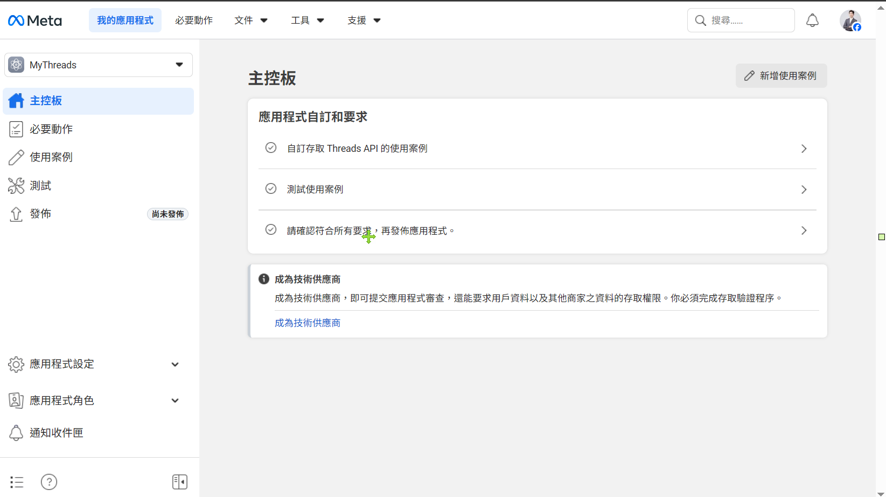
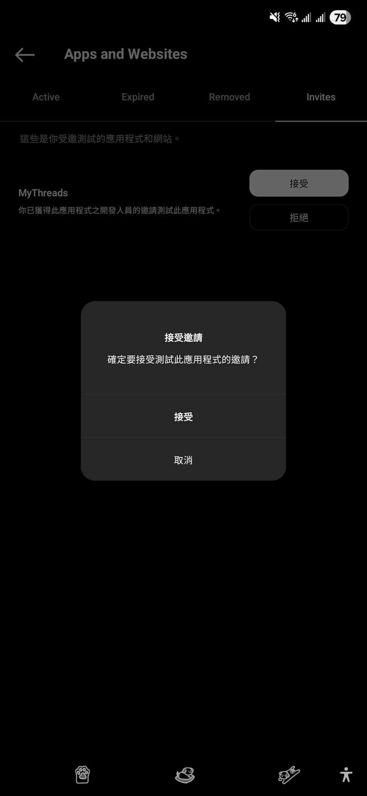
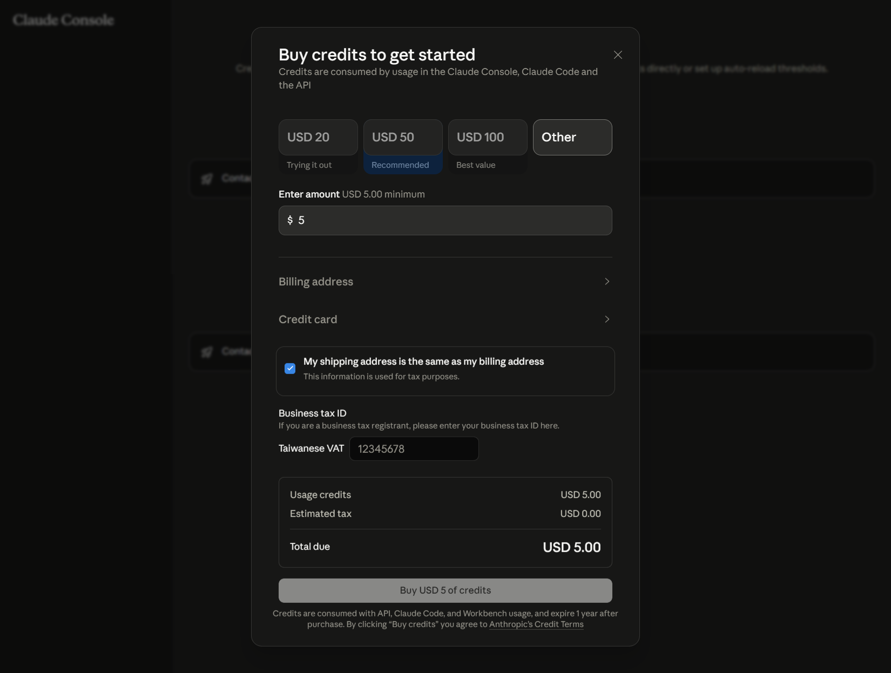

# Threads Bot 懶人版（30 分鐘上手）

> **比完整版簡 80%**：不用打指令、不用編輯 .env、不用看程式碼。
>
> 只要：申請 3 個帳號 → 雙擊 4 個檔案 → 完成。

如果想看每一步背後**為什麼**這樣做，看 [完整版 setup_guide.md](setup_guide.md)。

---

## 📋 開始前清單（5 分鐘）

打 ✅ 才往下：

- [ ] **Facebook 帳號**（你日常用的）
- [ ] **Threads 帳號**（跟 FB 同帳號體系）
- [ ] **Email**（驗證用）
- [ ] **信用卡**（要付 USD $5 給 Anthropic）
- [ ] **電腦裝好 Python 3.11+** → [這裡下載](https://www.python.org/downloads/)（**安裝時務必勾「Add Python to PATH」**）

---

## 🆘 萬用 SOS 提示詞

任何步驟卡關，把這段貼到 [Claude.ai](https://claude.ai)（免費）或 ChatGPT，**附上錯誤訊息或截圖**：

```
我在跟著 Threads bot 懶人版做設定，目前在「步驟 X」。

我看到的畫面/錯誤訊息：
[把畫面描述貼這裡，或截圖]

我的目標是：[寫一句你正在試做的事]

請告訴我下一步要怎麼做，把我當成完全不懂程式的人。
```

→ AI 會用你聽得懂的話帶你度過關卡。

---

## 第一階段：申請 3 個帳號 + 拿密鑰（~20 分鐘）

> 這部分**不能用腳本自動化**，要在網頁上手動點選。撐過去就好。

### 步驟 1：建 Meta App（5 分鐘）

1. 打開 [developers.facebook.com](https://developers.facebook.com/) → 用 FB 帳號登入
2. 打開 [建立 App 頁面](https://developers.facebook.com/apps/creation/)
3. **使用案例**：勾選「**存取 Threads API**」
4. **App 名稱**：填 `[你的名字]Bot`（不要含 Meta / Facebook / Threads 字樣）
5. **Email**：填你的 email
6. **商家資產組合**：選「**我還不想連結**」
7. 完成 → 進入主控板

✅ 應該看到這個畫面：



### 步驟 2：加 6 個權限 + 設定 Redirect URL（5 分鐘）

1. 主控板點「**自訂存取 Threads API 的使用案例**」
2. 進入「**權限和功能**」分頁
3. 找下面 6 個權限，每個都點「**新增**」：

```
threads_basic
threads_content_publish
threads_manage_replies
threads_read_replies
threads_keyword_search
threads_manage_insights
```

4. 切到「**設定**」分頁，3 個欄位填：

| 欄位 | 填入 |
|---|---|
| 重新導向 Callback 網址 | `https://localhost:8443/callback` |
| 解除安裝 Callback 網址 | `https://localhost:8443/deauth` |
| 資料刪除 Callback 網址 | `https://localhost:8443/delete` |

5. 點「**儲存變更**」
6. **同一頁複製這兩個值貼到記事本**：
   - **Threads 應用程式編號**（App ID）
   - **Threads 應用程式密鑰**（App Secret，點「顯示」）→ ⚠️ **千萬不要截圖外傳**

### 步驟 3：加自己當測試人員（3 分鐘）

1. 主控板左側「**應用程式角色**」→「**角色**」
2. 找「**Threads 測試人員**」 → 點「**新增 Threads 測試人員**」
3. 輸入你的 Threads username（不含 @）
4. 開**手機 Threads App** → 個人檔案 → 設定 → **「Apps and Websites」** → **「Invites」** 分頁 → 點 **「接受」** → 確認



> 找不到通知？開 [threads.net/manage/invites](https://www.threads.net/manage/invites)（網頁版）接受。

### 步驟 4：拿 60 天 Token（5 分鐘，這步最容易卡）

#### 4-A. 開授權頁

複製下面這串，**把 `__YOUR_APP_ID__` 換成你的 App ID**，貼到瀏覽器：

```
https://threads.net/oauth/authorize?client_id=__YOUR_APP_ID__&redirect_uri=https%3A%2F%2Flocalhost%3A8443%2Fcallback&scope=threads_basic%2Cthreads_content_publish%2Cthreads_manage_replies%2Cthreads_read_replies%2Cthreads_keyword_search%2Cthreads_manage_insights&response_type=code
```

→ 點「**允許**」 → 跳到一個「無法連線」的頁面（**正常的**）

→ **網址列**有完整 URL，找到 `code=` 後面那串，**不含 `#_`** 結尾，複製到記事本

#### 4-B. 換 Token

按 **Win 鍵搜尋「PowerShell」** 打開 → 把下面整塊複製貼上，**3 個 `__FILL_IN__` 換成你的值**：

```powershell
$appId = "__FILL_IN_YOUR_APP_ID__"
$appSecret = "__FILL_IN_YOUR_APP_SECRET__"
$code = "__FILL_IN_THE_CODE__"

$body = @{
  client_id     = $appId
  client_secret = $appSecret
  grant_type    = "authorization_code"
  redirect_uri  = "https://localhost:8443/callback"
  code          = $code
}
$shortResp = Invoke-RestMethod -Uri "https://graph.threads.net/oauth/access_token" -Method Post -Body $body
$longResp = Invoke-RestMethod -Uri "https://graph.threads.net/access_token?grant_type=th_exchange_token&client_secret=$appSecret&access_token=$($shortResp.access_token)"

Write-Host "==================================================="
Write-Host "把下面 4 個值複製到記事本：" -ForegroundColor Yellow
Write-Host ""
Write-Host "App ID:        $appId"
Write-Host "App Secret:    $appSecret"
Write-Host "User ID:       $($shortResp.user_id)"
Write-Host "Long Token:    $($longResp.access_token)"
Write-Host "==================================================="
```

→ 看到 4 個值印出來，全部複製到記事本（**Long Token 是一長串，THAA 開頭**）

> ⚠️ **失敗了**？code 過期（10 分鐘有效）。回 4-A 重來一次。或把錯誤訊息丟 SOS 提示詞給 AI 看。

### 步驟 5：拿 Anthropic API Key + 儲值 $5（5 分鐘）

1. 開 [console.anthropic.com](https://console.anthropic.com/) → 註冊登入
2. [API Keys 頁](https://console.anthropic.com/settings/keys) → 點「**Create Key**」 → 名稱 `threads-bot` → 複製 key 到記事本
3. 左側「**Plans & Billing**」→ 點 **Add Credits** → 充 USD $5
4. 填地址（**全部用英文/羅馬拼音**）→ 不會寫？ [中華郵政幫翻](https://www.post.gov.tw/post/internet/Postal/index.jsp?ID=207)
5. 填卡號 → Buy USD 5 of credits



---

## 第二階段：雙擊 4 個檔案（~5 分鐘）

> 從這邊開始**不用打指令**，全部雙擊就好。

### 雙擊 ① `setup.bat`（30 秒-1 分鐘）

→ 自動裝 Python 虛擬環境跟所有套件
→ 看到「✅ 安裝完成！」就 OK
→ 按任意鍵關閉視窗

### 雙擊 ② `configure.bat`（2 分鐘）

→ 跳出設定精靈，會問你 6 個問題：

| 問題 | 答案來源 |
|---|---|
| 1. App ID | 步驟 2 拿到的 |
| 2. App Secret | 步驟 2 拿到的 |
| 3. User ID | 步驟 4 拿到的（17 位數字） |
| 4. Username | 你 Threads 的 @ 不含 @ |
| 5. Long Token | 步驟 4 拿到的 THAA... |
| 6. Anthropic API Key | 步驟 5 拿到的 sk-ant-... |

→ 一個一個複製貼上 → 看到「✅ 設定完成！」

### 雙擊 ③ `verify.bat`（10 秒）

→ 自動測試你的設定能不能連 Threads + Claude

→ 預期看到：

```
--- Threads API ---
[OK] @你的username (id: ...)

--- LLM (claude) ---
[OK] reply: Threads 是 Meta 推出的文字社群平台...

[DONE]
```

兩段都 [OK] → 全部設定正確 🎉

如果有錯，把錯誤訊息丟 SOS 提示詞給 AI。

### 雙擊 ④ `start.bat` 或 `start_draft.bat`

| 雙擊這個 | 會發生什麼 |
|---|---|
| `start.bat` | **功能 ①**：每 5 分鐘自動檢查你 Threads 自家貼文留言並 AI 處理 |
| `start_draft.bat` | **功能 ②**：你貼陌生人貼文進去，Claude 用你的品牌語氣草擬回覆 |

→ 預設是 **DRY_RUN（試跑）模式**，bot 只會 log「會回什麼」**不會真的發送**
→ 觀察一兩天覺得品質 OK，再用記事本打開 `.env`，把 `DRY_RUN=true` 改成 `DRY_RUN=false` → 真的開始發送

→ 任何時候 **Ctrl+C** 停止

---

## 🎉 完成

你現在擁有：

✅ 24/7 自動處理自家留言（諮詢/感謝/負評會走不同 layer）
✅ 用 AI 草擬陌生人留言（你還是手動貼回去送出，**保護品牌**）
✅ 完整的合規護欄（不薦商品、不踩 spam 雷）

---

## 🔧 想改 bot 的個性？

預設語氣是泛用版本。要改成你自己領域：
- 看完整版指南的 [客製化章節](setup_guide.md#customize)
- 或丟 SOS 提示詞請 AI 帶你改

---

## 🆘 常見問題

| 狀況 | 怎麼辦 |
|---|---|
| `setup.bat` 說找不到 Python | 重裝 Python 並**勾 Add Python to PATH** |
| `verify.bat` Threads 段失敗 | 多半是 Token 貼錯。回 configure.bat 重填 |
| `verify.bat` LLM 段說 credit balance too low | 沒儲值或地址驗證失敗。回步驟 5 |
| `start.bat` 跑了但什麼都沒發生 | 你 Threads 貼文目前沒新留言。**這正常**——有留言才會處理 |
| 其他 | 把錯誤訊息丟 [SOS 提示詞](#-萬用-sos-提示詞) 給 Claude.ai |

---

> 想看每一步的完整解釋（包括架構、合規、進階用法），請參考 [完整版 setup_guide.md](setup_guide.md)。
